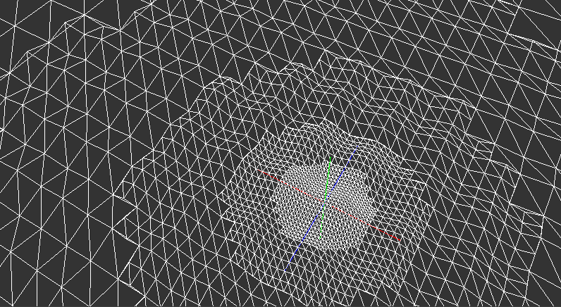

# cdlod
A C89 standard compliant, single header, nostdlib (no C Standard Library) Continuous Distance-Dependent Level of Detail (CDLOD).

<p align="center">
<a href="https://github.com/nickscha/cdlod"></a>
</p>

For more information please look at the "cdlod.h" file or take a look at the "examples" or "tests" folder.

> [!WARNING]
> THIS PROJECT IS A WORK IN PROGRESS! ANYTHING CAN CHANGE AT ANY MOMENT WITHOUT ANY NOTICE! USE THIS PROJECT AT YOUR OWN RISK!

<p align="center">
  <a href="https://github.com/nickscha/cdlod/releases">
    
  </a>
  <a href="https://github.com/nickscha/cdlod/releases">
    
  </a>
  <a href="https://opensource.org/licenses/MIT">
    
  </a>
  
  
</p>

## **Features**
- **C89 compliant** — portable and legacy-friendly  
- **Single-header API** — just include `cdlod.h`  
- **nostdlib** — no dependency on the C Standard Library  
- **Minimal binary size** — optimized for small executables  
- **Cross-platform** — Windows, Linux, MacOs 
- **Strict compilation** — built with aggressive warnings & safety checks  

## Quick Start

Download or clone cdlod.h and include it in your project.

```C
#include "cdlod.h" /* Continuous Distance-Dependent Level of Detail */

/* (1) Define a height function for a given x and z coordinate */
float custom_height_function(float x, float z)
{
  /* Flat Plane (replace with perlin/simplex noise or other height algorithms) */
  return 0.0f;
}

int main() {
    /* (2) Define a memory buffer for the gneerated cdlod vertice and indices */
    #define VERTICES_CAPACITY 200000
    #define INDICES_CAPACITY 200000
    float vertices[VERTICES_CAPACITY];
    int indices[INDICES_CAPACITY];
    int vertices_count = 0;
    int indices_count = 0;

    /* (3) Define when different lod ranges should be applied (distance to camera) */
    /*     This has to be sorted in an ascending order                             */
    /*     First = Highest Level of Detail                                         */
    float lod_ranges[] = {0.0f, 50.0f, 100.0f, 200.0f, 400.0f};
    float patch_size = 64.0f;
    int grid_radius = 1;

    /* (4) Define an eye/camera position from which the CDLOD grid should be generated */
    float camera_position_x = 0.0f;
    float camera_position_y = 10.0f;
    float camera_position_z = 0.0f;

    /* (5) Generate the CDLOD vertices and indices */
    cdlod(
        vertices, VERTICES_CAPACITY, &vertices_count,            /* Vertices data                                   */
        indices, INDICES_CAPACITY, &indices_count,               /* Indices data                                    */
        camera_position_x, camera_position_y, camera_position_z, /* Camera position                                 */
        custom_height_function,                                  /* Y-Heightmap function                            */
        patch_size,                                              /* How large is each patch                         */
        5, lod_ranges,                                           /* Number of lod levels and the ranges             */
        grid_radius                                              /* How big is the grid (1=3x3, 3=5x5 patches, ...) */
    );
 
    return 0;
}
```

## Run Example: nostdlib, freestsanding

In this repo you will find the "examples/cdlod_win32_nostdlib.c" with the corresponding "build.bat" file which
creates an executable only linked to "kernel32" and is not using the C standard library and executes the program afterwards.

## "nostdlib" Motivation & Purpose

nostdlib is a lightweight, minimalistic approach to C development that removes dependencies on the standard library. The motivation behind this project is to provide developers with greater control over their code by eliminating unnecessary overhead, reducing binary size, and enabling deployment in resource-constrained environments.

Many modern development environments rely heavily on the standard library, which, while convenient, introduces unnecessary bloat, security risks, and unpredictable dependencies. nostdlib aims to give developers fine-grained control over memory management, execution flow, and system calls by working directly with the underlying platform.

### Benefits

#### Minimal overhead
By removing the standard library, nostdlib significantly reduces runtime overhead, allowing for faster execution and smaller binary sizes.

#### Increased security
Standard libraries often include unnecessary functions that increase the attack surface of an application. nostdlib mitigates security risks by removing unused and potentially vulnerable components.

#### Reduced binary size
Without linking to the standard library, binaries are smaller, making them ideal for embedded systems, bootloaders, and operating systems where storage is limited.

#### Enhanced performance
Direct control over system calls and memory management leads to performance gains by eliminating abstraction layers imposed by standard libraries.

#### Better portability
By relying only on fundamental system interfaces, nostdlib allows for easier porting across different platforms without worrying about standard library availability.
